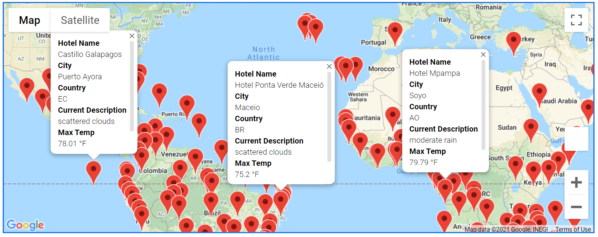

# World_Weather_Analysis

## Project Overview
Collect and analyze weather data to recommend hotels based on PlanMyTrip app user weather preferences.

1. Generate a set of 2,000 random latitudes and longitudes and retrieve nearest city, 
2. Perform an API call with OpenWeatherMap and retrieve weather data for each city.
2. Retrieve weather preference from user input.
3. Identify potential travel destinations and nearby hotels with Google maps popup markers.
4. Create a travel itinerary with four cities with Google maps directions.

## Resources
- Softwar: Python 3.7.6, Visual Studio Code, 1.52.1

## Challenge Summary

With a user input of 60 to 80 degrees of maximum temperature, the code was able to return a result of 261 cities with hotels from the database of random generated latitudes and longitudes. A marker layer was added to Google Maps to show the details of location, weather, and hotel in each city.  
  

An itnerary consisting of four cities in South Africa demostrated the ability to showcase travel directions within Google Maps.  
  
